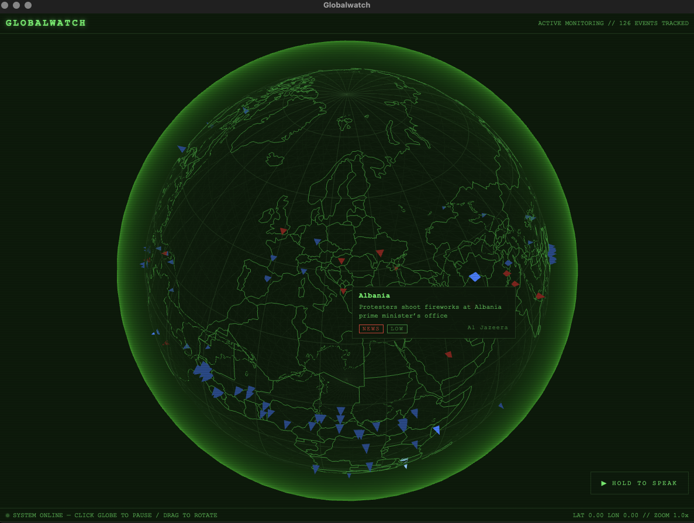

# globalwatch

A desktop application that displays an interactive 3D globe with a green-on-black matrix-style theme. It renders country outlines, lat/lon grid lines, and triangular event markers for dangerous weather patterns and news crises sourced from configurable feeds. Includes a voice-powered AI assistant interface.



## Features

- Interactive 3D globe with auto-spin (click to pause, drag to rotate/tilt)
- Green monochrome matrix aesthetic on black background
- Country outlines rendered from TopoJSON data
- Triangular event markers colour-coded by category and severity:
  - **Blue** — severe weather events (low → medium → high brightness)
  - **Red** — news/crisis events (low → medium → high brightness)
- Hover tooltip on markers showing headline, category, and severity
- Configurable event sources via `sources.config.json` (URL, API token, feed type, daily/hourly rate caps)
- Push-to-talk voice interface (STT → AI assistant → TTS)
  - Speech-to-text via [whisper.cpp](https://github.com/ggerganov/whisper.cpp) (native Rust bindings)
  - AI assistant via local LLM (LM Studio / any OpenAI-compatible endpoint)
  - Text-to-speech via native macOS `say` command (enhanced voices) or `espeak-ng` + PipeWire/PulseAudio on Linux
  - Conversation history with context carry-over
  - **[Experimental]** Real-time web search — when a [Kagi](https://kagi.com/) API key is configured the LLM gains a `web_search` tool and can look up current events mid-conversation (disabled by default; Kagi API access is in closed beta)
- 60 FPS rendering target

## Platform Support

macOS is the primary development target. Linux support is **experimental** — core features work but audio routing may require manual configuration depending on your Bluetooth/audio setup (see [Voice Assistant Setup](#voice-assistant-setup)).

## Prerequisites

- [Node.js](https://nodejs.org/) (LTS recommended)
- [Rust](https://www.rust-lang.org/tools/install) 1.77.2+
- [Tauri 2 prerequisites](https://v2.tauri.app/start/prerequisites/) for your platform (system libs, Xcode CLI tools on macOS, etc.)
- CMake (required to build whisper.cpp — install via `brew install cmake` on macOS or `sudo pacman -S cmake` on Arch-based Linux)

**Linux additional requirements (voice TTS):**
```bash
sudo pacman -S espeak-ng   # Arch/CachyOS
# or
sudo apt install espeak-ng # Debian/Ubuntu
```
`paplay` (from `libpulse`) is also required for audio output through PipeWire/PulseAudio and is typically pre-installed on desktop Linux.

## Getting Started

```bash
# Install frontend dependencies
make install

# Launch the app in dev mode (Tauri window + Vite HMR)
make dev
```

### Voice Assistant Setup

The voice assistant requires a Whisper model and a running LLM server.

**1. Download the Whisper model**

Download `ggml-base.en.bin` (~148 MB) from [Hugging Face](https://huggingface.co/ggerganov/whisper.cpp/tree/main) and place it in the app's models directory:

```
# macOS
~/Library/Application Support/com.globalwatch.app/models/ggml-base.en.bin

# Linux
~/.local/share/com.globalwatch.app/models/ggml-base.en.bin
```

The app will show the exact path and a setup prompt if the model is missing.

**2. Start a local LLM**

The assistant sends queries to an OpenAI-compatible chat completions endpoint at `http://localhost:1234/v1/chat/completions`. Any of these will work:

- [LM Studio](https://lmstudio.ai/) — load any chat model and enable the local server
- [Ollama](https://ollama.com/) — run with `OLLAMA_HOST=localhost:1234 ollama serve`
- Any OpenAI-compatible API server on port 1234

**3. Use the voice button**

Hold the voice button in the bottom-right corner of the app, speak your question, and release. The pipeline runs: mic capture → Whisper transcription → LLM response → spoken reply via TTS.

**4. (Experimental) Enable web search**

> **Note:** Kagi API access is currently in closed beta. Request access at [kagi.com/api](https://kagi.com/api). See provider for current API pricing.

When a Kagi API key is present, the LLM is given a `web_search` tool and will automatically use it for questions that need real-time information. Without a key the assistant behaves as before — no web access.

Configure the key in either of two ways:

- **Environment variable** — set `KAGI_API_KEY` before launching the app.
- **`sources.config.json`** — add your token to the `kagi-search` entry (already present in `sources.config.example.json`):

```json
{
  "id": "kagi-search",
  "token": "YOUR_KAGI_API_KEY",
  "enabled": false
}
```

The `enabled` flag controls event-feed polling and is unused for web search — the search tool activates solely based on whether a non-empty token is found.

## Event Sources

Event sources are configured in `sources.config.json` at the project root. Each entry supports:

| Field | Description |
|---|---|
| `id` | Unique identifier |
| `name` | Display name |
| `enabled` | Whether the source is active |
| `category` | `"weather"` or `"news"` — controls marker colour |
| `feedType` | Feed parser to use (`atom`, `rss`, `newsapi`, `openweather`, `reliefweb`) |
| `url` | API or feed endpoint |
| `token` | API key (leave `""` or `null` if not required) |
| `params` | Extra query parameters passed to the request |
| `rateCap` | Optional `{ requestsPerDay, requestsPerHour, note }` — prevents exceeding API limits |

**Setup:** `sources.config.json` is gitignored to prevent tokens from being committed. A template is provided as `sources.config.example.json`. Copy it and fill in your keys:

```bash
cp sources.config.example.json sources.config.json
# edit sources.config.json — fill in tokens, set enabled: true for desired sources
```

## Make Targets

| Command | Description |
|---|---|
| `make install` | Install npm dependencies |
| `make dev` | Launch Tauri app with Vite HMR |
| `make dev-voice` | Launch with microphone support (codesigned for macOS) |
| `make dev-web` | Frontend only in browser (no Tauri shell) |
| `make build` | Full production build |
| `make package` | Production build with platform bundle (.app/.dmg, .AppImage/.deb) |
| `make lint` | Run ESLint + cargo clippy |
| `make test` | Run Rust tests |
| `make clean` | Remove dist, Vite cache, and Rust target directory |

## Project Structure

```
sources.config.example.json # Event source template (commit-safe, tokens empty)
sources.config.json         # Your local config with real tokens (gitignored)

src/                        # React/TypeScript frontend
├── components/
│   ├── Globe.tsx           #   Globe viewer — renders scene, manages hover tooltip
│   ├── VoiceButton.tsx     #   Push-to-talk voice UI
│   └── VoiceButton.css
├── lib/
│   ├── audioUtils.ts       #   Audio utilities, WAV playback helpers
│   └── tauriVoice.ts       #   Typed wrappers for Tauri voice commands
├── globe/
│   ├── scene.ts            #   Scene, camera, renderer setup
│   ├── materials.ts        #   Shared colour constants and materials
│   ├── wireframe.ts        #   Lat/lon grid lines
│   ├── countries.ts        #   Country outlines from TopoJSON
│   ├── markers.ts          #   Event marker rendering (blue=weather, red=news)
│   └── interactions.ts     #   Mouse/touch controls + hover raycasting
├── data/                   #   Static assets (TopoJSON, etc.)
└── main.tsx                #   App entry point

src-tauri/                  # Tauri 2 / Rust backend
├── src/
│   ├── main.rs             #   Tauri app bootstrap
│   ├── lib.rs              #   Commands, plugins, state management
│   └── voice/              #   Voice pipeline
│       ├── capture.rs      #     Native mic capture via cpal
│       ├── stt.rs          #     Whisper speech-to-text
│       ├── llm.rs          #     LM Studio / OpenAI-compatible chat client
│       ├── tts.rs          #     Text-to-speech (macOS: say, Linux: espeak-ng)
│       └── models.rs       #     Model file path management
├── tauri.conf.json         #   App identity, window config, bundling
└── Cargo.toml              #   Rust dependencies
```

## Tech Stack

- **App shell**: [Tauri 2](https://v2.tauri.app/) (Rust backend) + React 19 + TypeScript
- **Bundler**: [Vite](https://vite.dev/)
- **3D rendering**: [Three.js](https://threejs.org/)
- **Map data**: [TopoJSON](https://github.com/topojson/topojson)
- **Speech-to-text**: [whisper-rs](https://github.com/tazz4843/whisper-rs) (whisper.cpp Rust bindings)
- **LLM inference**: Local via [LM Studio](https://lmstudio.ai/) or [Ollama](https://ollama.com/) (OpenAI-compatible API)
- **Text-to-speech**: Native macOS `say` command (enhanced system voices) / `espeak-ng` + PipeWire on Linux
- **Audio capture**: [cpal](https://github.com/RustAudioGroup/cpal) (native cross-platform audio I/O)
- **Web search** *(experimental)*: [Kagi Search API](https://kagi.com/api) — tool-calling integration for real-time LLM web search

## Voice Pipeline

```
Hold button → Native mic capture (cpal, Rust backend)
    → Downsample to 16kHz mono
    → whisper-rs transcription
    → HTTP POST to LLM (localhost:1234)
    → [if Kagi key configured] LLM calls web_search tool → Kagi API → result injected into context
    → Response text displayed + spoken via native TTS
```

## Data Flow

1. Backend reads `sources.config.json` (or `sources.config.local.json`) at startup
2. Enabled sources are polled on a schedule, respecting per-source rate caps
3. Events are classified by category (weather / news) and geocoded
4. Results are stored in SQLite
5. Frontend fetches active events via Tauri commands
6. Markers are rendered on the globe — blue for weather, red for news, brightness by severity
7. Hovering a marker shows its headline, category badge, and severity badge

## Packaging

```bash
make package
```

This produces platform-specific bundles:
- **macOS**: `.app` and `.dmg` in `src-tauri/target/release/bundle/`
- **Linux**: `.AppImage` and `.deb` in `src-tauri/target/release/bundle/`

## License

[MIT](LICENSE)
